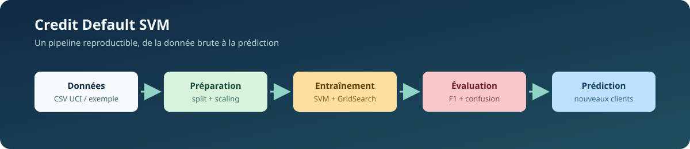
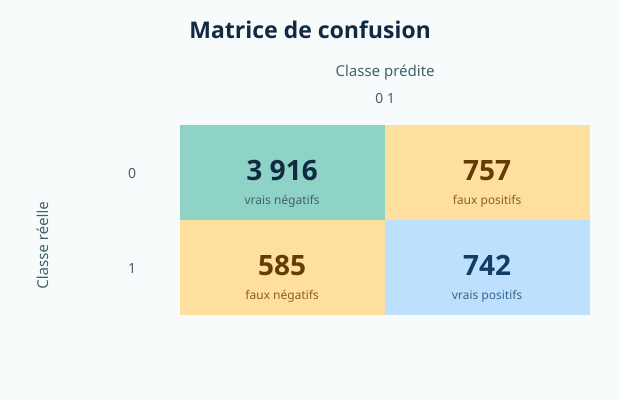
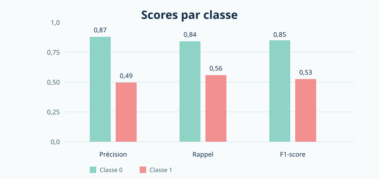

# Credit Default SVM

> Pipeline Python reproductible pour estimer le risque de défaut de paiement d’un client de carte de crédit le mois suivant.

<p align="center">
  
</p>

<p align="center">
  <a href="https://www.python.org/"></a>
  <a href="https://scikit-learn.org/"></a>
  <a href="LICENSE"></a>
</p>

## Vue d’ensemble

Ce projet met en œuvre une classification binaire avec un **SVM** (*Support Vector Machine*) pour prédire la variable `default.payment.next.month`.

Le pipeline couvre l’ensemble du cycle de traitement :

- chargement et validation d’un fichier CSV au format UCI ;
- séparation train/test stratifiée et reproductible ;
- standardisation sans fuite de données ;
- recherche d’hyperparamètres avec `GridSearchCV` ;
- évaluation par rapport de classification et matrice de confusion ;
- sérialisation du modèle et du scaler ;
- prédiction sur de nouveaux clients avec contrôle des colonnes.

> **Important :** ce projet est un exemple pédagogique et expérimental. Il ne constitue pas un système de décision de crédit prêt pour la production.

## Résultats

Les résultats ci-dessous proviennent du modèle enregistré dans `outputs/metrics.json`, entraîné avec la grille rapide sur le jeu de données UCI.

| Indicateur | Classe 0 · pas de défaut | Classe 1 · défaut | Global |
| --- | ---: | ---: | ---: |
| Précision | 0,87 | 0,49 | 0,79 pondéré |
| Rappel | 0,84 | 0,56 | 0,78 |
| F1-score | 0,85 | 0,53 | 0,78 pondéré |
| Support | 4 673 | 1 327 | 6 000 |

**Accuracy : 0,776** · **F1 macro : 0,689** · **Meilleurs paramètres :** `C=1`, `kernel=rbf`, `gamma=scale`.

### Matrice de confusion

<p align="center">
  
</p>

|  | Prédit : 0 | Prédit : 1 |
| --- | ---: | ---: |
| Réel : 0 | 3 916 | 757 |
| Réel : 1 | 585 | 742 |

La classe `1` représente le défaut de paiement. Le rappel de cette classe est particulièrement important pour mesurer la capacité du modèle à détecter les clients à risque.

### Comparaison des scores

<p align="center">
  
</p>

## Données

Le projet s’appuie sur le jeu de données [Default of Credit Card Clients](https://archive.ics.uci.edu/dataset/350/default+of+credit+card+clients), publié par l’UCI Machine Learning Repository.

Le fichier complet doit être placé ici :

```text
data/UCI_Credit_Card.csv
```

Le dépôt contient aussi :

| Fichier | Rôle |
| --- | --- |
| `data/sample_credit_data.csv` | Petit jeu synthétique pour valider rapidement le pipeline |
| `data/new_clients_example.csv` | Exemples de clients destinés à la prédiction |
| `data/UCI_Credit_Card.csv` | Jeu de données complet, à télécharger séparément |

Les données d’entrée doivent contenir `ID`, la cible `default.payment.next.month` pour l’entraînement, ainsi que les 23 variables explicatives du jeu UCI. Pour la prédiction, `ID` est facultatif et la cible ne doit pas être fournie.

## Installation

```bash
git clone https://github.com/Adam01-i/credit-default-svm.git
cd credit-default-svm

python3 -m venv venv
source venv/bin/activate
python3 -m pip install --upgrade pip
python3 -m pip install -r requirements.txt
```

Sous Windows PowerShell :

```powershell
venv\Scripts\Activate.ps1
```

Téléchargez ensuite le fichier UCI et placez-le dans `data/UCI_Credit_Card.csv`.

## Entraînement

### Vérification rapide

Cette commande utilise le jeu synthétique et une grille réduite :

```bash
python3 src/train.py --data data/sample_credit_data.csv --quick
```

### Entraînement sur le jeu complet

```bash
# Grille réduite, recommandée pour un premier entraînement
python3 src/train.py --data data/UCI_Credit_Card.csv --quick

# SVM unique, sans recherche d’hyperparamètres
python3 src/train.py --data data/UCI_Credit_Card.csv --no-search

# Grille complète, plus coûteuse avec le noyau RBF
python3 src/train.py --data data/UCI_Credit_Card.csv
```

Les artefacts sont écrits dans :

```text
models/model.pkl       # SVM, scaler et ordre des variables
outputs/metrics.json    # métriques et matrice de confusion
```

## Prédiction

Après l’entraînement, prédisez le risque de nouveaux clients avec :

```bash
python3 src/predict.py --clients data/new_clients_example.csv
```

Pour charger un modèle situé ailleurs :

```bash
python3 src/predict.py \
  --model chemin/vers/model.pkl \
  --clients chemin/vers/nouveaux_clients.csv
```

Exemple de sortie :

```text
Client 0 -> 1 (DÉFAUT PROBABLE)
Client 1 -> 0 (pas de défaut prévu)
```

Le script vérifie que toutes les variables attendues sont présentes et réutilise exactement le scaler ajusté lors de l’entraînement.

## Choix techniques

| Décision | Mise en œuvre |
| --- | --- |
| Prévention de la fuite | `StandardScaler` ajusté uniquement sur `X_train` |
| Reproductibilité | `random_state=42` et split stratifié |
| Déséquilibre des classes | `class_weight="balanced"` |
| Optimisation | `GridSearchCV` avec score `f1` et validation croisée à 3 plis |
| Compatibilité des entrées | Noms et ordre des variables sauvegardés avec le modèle |
| Sorties interprétables | Rapport de classification et matrice de confusion JSON |

## Structure du projet

```text
credit-default-svm/
├── data/
│   ├── UCI_Credit_Card.csv
│   ├── sample_credit_data.csv
│   └── new_clients_example.csv
├── models/
│   └── model.pkl
├── outputs/
│   ├── metrics.json
│   └── figures/
│       ├── classification-metrics.svg
│       ├── confusion-matrix.svg
│       └── pipeline.svg
├── src/
│   ├── data_prep.py
│   ├── predict.py
│   └── train.py
├── requirements.txt
└── README.md
```

## Limites et précautions

- Les performances sont mesurées sur un split train/test unique ; une validation externe et une analyse de stabilité seraient nécessaires avant toute utilisation réelle.
- Les données peuvent contenir des biais historiques et ne doivent pas servir seules à accorder ou refuser un crédit.
- Le SVM ne fournit pas ici de probabilité calibrée : `1` est une classe prédite, pas une probabilité de défaut de 100 %.
- Le jeu de données UCI n’est pas redistribué dans ce dépôt ; consultez ses conditions d’utilisation avant tout usage.

## Licence

Ce projet est distribué sous licence MIT. Consultez [LICENSE](LICENSE).
